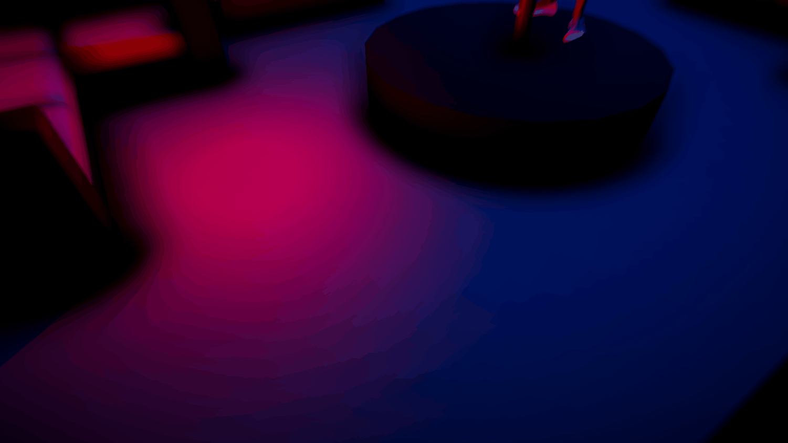
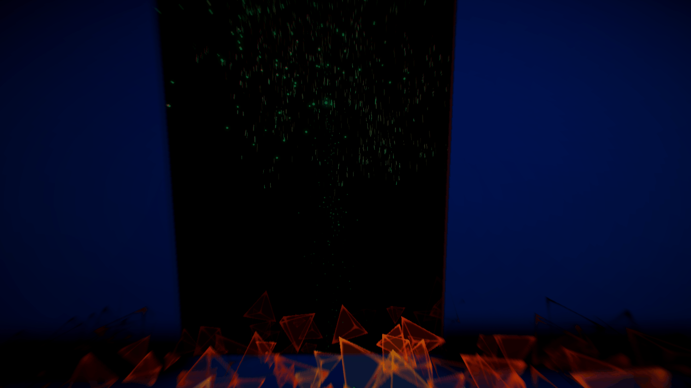

## MUREX 

## NOTE D'INTENTION

Un univers parallèle en réalité virtuelle de contrôle et de manipulation d'esprit, on incarnage un personnage enigmatique qui réalise des expériences sur des sujets pour le moins .. intrigants.
## PITCH

Plongez au coeur d’un univers parallèle dont vous êtes le héro.
Soyez vous-même, ne vous laissez pas influencer par ce qui gravite autour de vous, ni par les obstacles provoqués par votre entourage. Évadez vous d’une dimension fantasmagorique n’étant que le mirage d’un univers que vous ne contrôlez pas
Saurez vous y arriver ? 

## CONCEPT / ANGLE ET POINT DE VUE
> *Orientation qu'on souhaite donner au projet*

- Contrôle de l'esprit
- Puppet / Marionnette
- Expériences visuelles

---

### VISUELS

# **Forte identité visuelle**

### Influences : 
Clip Muse 

Black Mirror
Orange Mécanique

## CIBLES 
> *A qui on s'addresse*

### PERSONAS 
  
   
   
    - Sam, étudiant en droit
      - Informations de base :
          - Age : 20 ans
          - Situation familiale : Célibataire, sans enfant
          - Centres d'interêt : Réseaux sociaux, jeux vidéos, pizza, courses de voitures
          - vit en France dans une zone résidentielle
          - Traits de caractère : Accent du sud
          - Il porte des adidas Vegan parce que c'est à la mode
      - Objectifs :
          - Augmenter ses relations sur LinkedIn
          - Soigner son image numérique au maximum et se faire connaître dans le milieu des courses automobiles
          - Découverte du projet :
            - Bouche à oreilles
      - FREINS
        - Epileptique 
        - Trop sensible

   
   
    - Virginie, manager dans une start-up
      - Informations de base :
        - Age : 28 ans
        - Situation familiale : Célibataire, sans enfant
        - Centres d'interêt : Réseaux sociaux, Design, Relations sociales
        - Vit en France dans une collocation
        - Traits de caractère : Inquiète du regard des gens
        - Aime la mode, prendre ses plats en photos
      - Objectifs :
        - Fare évoluer sa start-up
      - Découverte du projet :
        - Sur un article de jeux vidéos 
      - FREINS
        - Trop sensible
        - Fragile
        
        
        

### Keywords 

Immersion experience emotion découverte illusoire vorace plaisir coloré chromatique exotisme sens exorbitant innovant réalité virtuelle imagination paranoia voyage pèlerinage frémissant frisson phase technologie vision mirage illusion chimère alice univers dimension silent hill 

The sinister truth du project mk ultra

Manipulation de l'esprit par des expériences

## EXAMPLE SCENE

[MIND CONTROLTHEORY EXPERIMENT]

## EN VRAC

- MIND CONTROL PRIVATE CLUB

- MIND CONTROL SOCIAL EXPERIMENT

 

Lieu d'expériences, de rencontre, de découvertes 

Un délire à la "Freak Show" dans l'idée de quelque chose jouant avec la phantasmagorie et le contrôl de l'esprit
Sauf qu'un freak show on est spectateur de "bêtes de foires" exposées qui sont sensées nous impressionner ou nous faire peur, à l'inverse ici on peut jouer avec notre peur, celle des autres et provoquer des réactions attendues.

Le Manoir du T est parfait pour ça, leur crédo 
> "On travaille l’émotion, la conscience, l’enrichissement, la liberté"
Nous correspond parfaitement, la représentation d'un certain groupe d'individus regroupés dans un club privé où ce qu'il se passe dans le club, reste dans le club.

- 5S CLUB

 Incendie qui se déclenche sur une piece a coté
 tout le monde s'en bat les couilles
 2 pieces supplémentaires pour les lvl interactions
 
 - Feelings interaction !!!
 - Normal => Suit la trame principale => 
 - Selfish => Guilt, se libére rapidement de la conversation, sort avec tout le monde 
 - Empathique => Perdre du temps, perdre le round

 
 
 Trame de démo : 
 La scène principale est une sombre salle avec panel de contrôle et un bouton d'action, une simple interaction avec ce dernier et on se trouve plongé dans l'univers en question. 
 Un Univers abstrait, dans une boite de nuit.
 Un évènement se déclenche, et plusieurs choix sont proposés, quelle voie choisir ? 
 Ces evénements sont déclenchés à distances et les posent des questions aux spectateurs autours du principal acteur, les réponses influent sur l'univers. 
 
 
 
 
 
 ---
 
 
 
 
 

